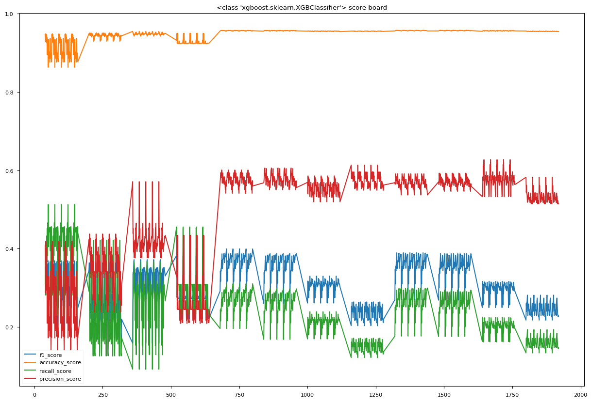
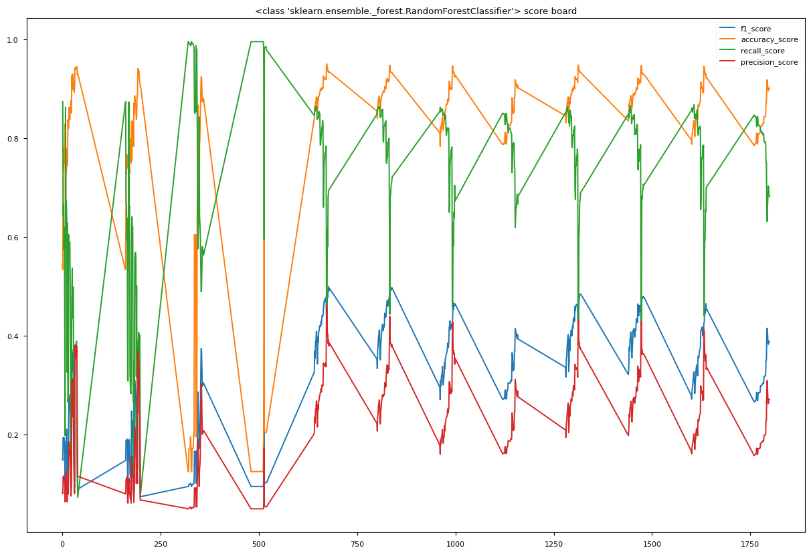
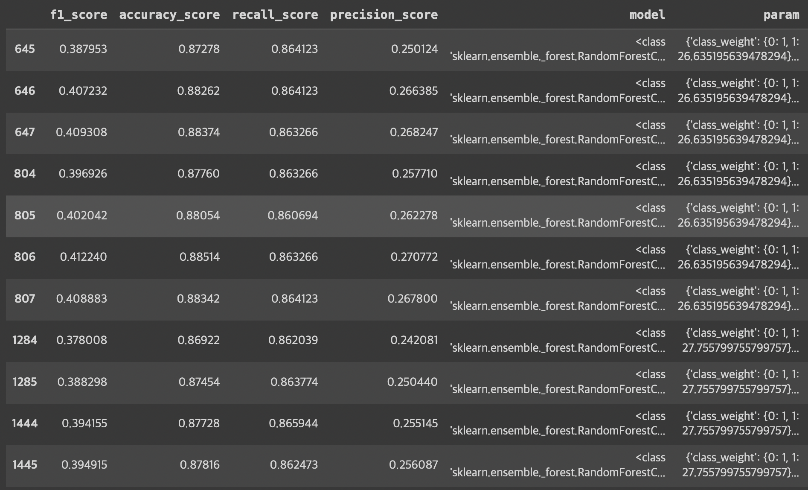

## 결제 예측 모델링

### 1. 배경 및 목적
**배경**
* 마케팅팀에서 업무 요청이 왔다고 가정한다. 마케팅 팀이 관심을 두는 것은 회원의 행동 패턴을 근거로, **결제로 전환할 유저를 모델을 통해 예측**하는 것이 가능한지 여부이다.

**목적**
* 효율적인 예산 집행을 위해 유저의 행동을 기반으로, 결제 가능성이 높은 유저를 선별하여 해당 유저를 위주로 마케팅 활동을 진행한다.

### 2. 데이터 탐색 및 전처리
**탐색**
* 클래스 불균형에 대해서 Class Weight / 재샘플링을 고려한다.
* 특징의 Type을 확인하고, 결측치 / 분포(Boxplot, Histogram) / 이상치 / 특징간 선형 상관성을 탐색한다.

**전처리**는 탐색 내용을 토대로 다음을 진행한다.
* 결측치 - IQR을 활용하여 결측치를 대체한다.
* 분포 - 데이터의 분포와 라벨과의 관계를 고려하여 이진형으로 변환다. 또한 Log / Min Max Scaler를 사용하여 데이터의 분포를 변환한다. 
* 이상치 - 데이터의 치우침으로 인해 z-score를 사용해서 이상치를 판단한다.

### 3. 모델 학습
모델 학습을 위한 데이터는 약 14만개이다. 샘플과 특징의 비율은 10118 : 1이다.
데이터 전처리를 통해 학습에 사용할 데이터에는 연속형과 이진형이 섞여있다. 단순한 모델보다는 **Tree 계열의 앙상블 모델(Random Forest, XGB)**을 선택한다.

**결제로 전환할 유저를 예측**하는 일9 목적이다. 그래서 **Recall(전환율)**을 활용해 모델을 선정한다. 다만, 현재는 클래스 불균형 문제가 있기 때문에 Recall을 높이면, Accuracy(정확도)가 떨어지는 문제가 있다. 그래서 최종적으로 선택하는 모델은 재현율이 높으면서 적당한 정확도를 가지는 모델을 최종적으로 선정한다.

### 4. 모델 선정
최종적으로 **Random Forest**를 사용한다.

XGB 학습 결과

XGB는 학습 내내 재현율이 계속해서 낮은 상태로 유지된다. 그래서 배제한다.

Random Forest 학습 결과

XGB와는 다르게 Recall이 높은 수치를 가진다. 그래서 Recall이 높은 수치를 가지면서 적절한 Accuracy를 갖는 Random Forest를 선택한다. 하지만, Random Forest의 Recall이 0.9 보다 커지면, Accuracy가 급격하게 떨어진다. 그래서 두 지표가 적절한 값을 갖는 0.86을 기준으로 최종 모델을 선택한다.
